# 📘 Documentación del Sistema - Agenda Revitek

Este documento proporciona una visión técnica detallada del sistema de agendamiento Revitek. Está diseñado para ayudar a nuevos desarrolladores a entender la arquitectura, los flujos de datos y la lógica de negocio.

---

## 1. Arquitectura del Sistema

El proyecto sigue una arquitectura **Client-Server** desacoplada:

*   **Frontend:** React (Vite) + TailwindCSS. Se encarga de la interfaz de usuario para clientes y administradores.
*   **Backend:** Django REST Framework (DRF). Maneja la lógica de negocio, base de datos y servicios externos.
*   **Base de Datos:** PostgreSQL.
*   **Servicios Externos:** Meta Cloud API (WhatsApp Business) para notificaciones y chatbot.

---

## 2. Flujo Principal: Ciclo de Vida de la Reserva

El núcleo del sistema es el manejo de reservas. El estado de una reserva (`status`) dicta el comportamiento del sistema.

### Estados de la Reserva (`Reservation` model)

1.  **PENDING (Pendiente):**
    *   Estado inicial cuando un cliente crea una reserva desde la web o el chatbot.
    *   El administrador debe revisarla.

2.  **CONFIRMED (Confirmada por Admin):**
    *   El administrador aprueba la reserva.
    *   **Acción Automática:** Al guardar este estado, un **Signal** (`trigger_whatsapp_notifications`) detecta el cambio.
    *   El sistema cambia inmediatamente el estado a `WAITING_CLIENT`.

3.  **WAITING_CLIENT (Esperando al Cliente):**
    *   Estado transitorio. El sistema genera un **Token Único** y envía un enlace de confirmación por WhatsApp al cliente.
    *   El enlace tiene una validez de 2 horas.

4.  **RECONFIRMED (Re-confirmada):**
    *   El cliente hace clic en el enlace de WhatsApp o confirma vía botón en el chat.
    *   Este es el estado final "seguro" para proceder con el servicio.

5.  **CANCELLED (Cancelada):**
    *   Puede ser cancelada por el Admin, el Cliente, o automáticamente por un **Job** (`expire_reservations`) si el cliente no confirma en 2 horas.

### Diagrama de Flujo

```mermaid
graph LR
    A[Cliente Crea Reserva] -->|PENDING| B(Revisión Admin)
    B -->|Aprueba| C{Generación Token}
    C -->|Envía WhatsApp| D[WAITING_CLIENT]
    D -->|Click en Link| E[RECONFIRMED]
    D -->|Expira 2h| F[CANCELLED]
```


---

## 3. Módulos del Backend (`apps/`)

### 📅 `apps.agenda`
Maneja la disponibilidad y las reservas.
*   **Models:**
    *   `Reservation`: La entidad principal.
    *   `Professional`: Los técnicos que realizan los servicios.
    *   `Slot`: Bloques de tiempo disponibles (generados automáticamente).
    *   `SlotBlock`: Bloqueos manuales (vacaciones, licencias).
*   **Signals (`signals.py`):** Contiene la lógica reactiva. Aquí es donde se dispara el envío de WhatsApp cuando el admin confirma.
*   **Management Commands:** `expire_reservations.py` (comando para limpiar reservas no confirmadas).

### 💬 `apps.whatsapp`
Integra la API de WhatsApp Business.
*   **Services (`services.py`):**
    *   `MetaClient`: Clase cliente que hace las peticiones HTTP a Facebook Graph API.
    *   `WebhookHandler`: Procesa los mensajes entrantes (webhooks) desde WhatsApp.
    *   `ChatBot`: Máquina de estados simple para el flujo conversacional automático.
*   **Models:**
    *   `WhatsAppLog`: Registro de auditoría de todos los mensajes enviados y recibidos.
    *   `WhatsAppSession`: Mantiene el estado de la conversación del usuario (ej: `SELECT_DATE`, `WAITING_FOR_EMAIL`).

### 🛠 `apps.catalog`
*   **Models:** `Service` (Lavado, Detailing, etc.), `Category`. Define precios y duraciones.

### 👥 `apps.clients`
*   **Models:** `User` (Custom User Model), `Address`, `Vehicle`.

---

## 4. Integración con WhatsApp

### Envío de Mensajes
El sistema utiliza `MetaClient` para enviar dos tipos de mensajes:
1.  **Plantillas (Templates):** Para iniciar conversaciones (ej: confirmación de reserva). Requieren aprobación de Meta.
2.  **Mensajes de Texto/Interactivos:** Para responder al usuario dentro de la ventana de 24 horas.

### Webhook
El endpoint `/api/whatsapp/webhook/` recibe notificaciones de Meta.
*   Verifica la firma de seguridad (`WHATSAPP_VERIFY_TOKEN`).
*   Procesa mensajes de texto para el Chatbot.
*   Procesa clics en botones (Confirmar/Cancelar reserva).

---

## 5. Configuración Clave (`settings.py` y `.env`)

Para que el sistema funcione, las siguientes variables de entorno son críticas:

*   `DATABASE_URL`: Conexión a PostgreSQL.
*   `WHATSAPP_ACCESS_TOKEN`: Token de larga duración de Meta.
*   `WHATSAPP_PHONE_NUMBER_ID`: ID del número de teléfono en Meta.
*   `FRONTEND_URL`: URL base para generar los links de confirmación (ej: `https://tu-app.vercel.app` o `http://localhost:5173`).

---

## 6. Comandos Útiles para Desarrolladores

```bash
# Correr servidor local
python manage.py runserver

# Crear migraciones (si modificas models.py)
python manage.py makemigrations
python manage.py migrate

# Expirar reservas antiguas (Job manual)
python manage.py expire_reservations

# Verificar logs de WhatsApp (Shell)
python manage.py shell
>>> from apps.whatsapp.models import WhatsAppLog
>>> WhatsAppLog.objects.last()
```
